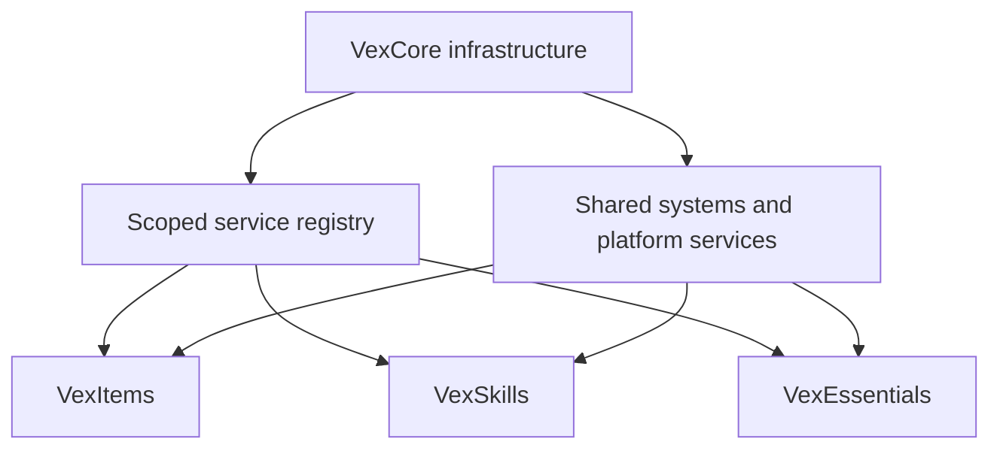

  <h1>VexCore</h1>
  
<strong>The shared infrastructure behind the VexSoft plugin ecosystem</strong>

  

    
    
    
    
    
    
  

VexCore brings together the technical foundations that would otherwise have to be built and maintained separately in every project. It gives VexSoft plugins a consistent environment and allows them to work together without tightly coupling their implementations.

> [!IMPORTANT]
> VexCore is infrastructure, not a gameplay plugin. Items, skills, quests, and general server features remain in their own projects.

## At a Glance

| Foundation | Player-facing systems | Runtime | Compatibility |
| --- | --- | --- | --- |
| Scoped service registry | Localization | Paper and Folia scheduler | Minecraft version adapters |
| Shared plugin lifecycle | Commands and inventories | Player data and caching | Packet abstraction |
| Configuration system | Dialogs and messages | PostgreSQL persistence | Data Component abstraction |

## Purpose

Every VexSoft plugin receives its own isolated service scope. Services can be published through a central registry and accessed by other systems without exposing or depending on their concrete implementations.

VexCore also manages the shared plugin lifecycle. Services, commands, listeners, inventories, and data containers follow the same registration rules and are released in a controlled way when a plugin shuts down.

The goal is simple: provide a modern and predictable foundation for new plugins without rebuilding the same infrastructure every time.

> [!NOTE]
> Each plugin owns an isolated service scope. Shared contracts remain accessible through VexCore while plugin-specific implementations stay separate.

## Features

### Service Registry

- Owner- and plugin-scoped services
- Hierarchical resolution between plugins and internal modules
- Lazy references for services that become available later
- Class-based creation of service implementations
- Dependency validation and ordered initialization
- Safe rollback when a service cannot be created
- Controlled cleanup of every service owned by a plugin

### Shared Plugin Foundation

- A consistent lifecycle for every VexSoft plugin
- Central registration of services, commands, listeners, and inventories
- An isolated service registry for each plugin
- Configurable and colored console prefixes
- Automatic connection to the VexCore infrastructure
- Clear separation between public APIs and runtime implementations

### Configuration System

- YAML configurations powered by Configurate
- A shared directory structure under `plugins/VexSoft/PluginName`
- Bundled default files and user-defined configurations
- Structured sections and typed values
- Readable warnings for invalid or broken files

### Localization System

- Adventure Components instead of plain text messages
- Any number of language files per plugin and language
- English defaults with automatic fallback behavior
- Support for both single messages and multi-line lists
- Placeholders, prefixes, and direct message delivery
- One centrally stored player language shared by all VexSoft plugins
- Language files can be reloaded while the server is running

### Command Framework

- Class-based command registration without command entries in `plugin.yml`
- Root commands, subcommands, and arguments
- Optional and greedy arguments
- Dynamic suggestions
- Permission checks for both execution and suggestions
- One command structure shared across all plugins

### Player Data

- One global `VexPlayer` for each player
- Extensible data containers owned by individual plugins
- Shared access to cached player data
- Controlled and thread-safe container updates
- PostgreSQL persistence with automatic schema extension
- Saving on disconnect, shutdown, and scheduled autosaves
- New data containers can be introduced through later plugin updates

### Cache System

- Synchronous and asynchronous caching powered by Caffeine
- Configurable size and expiration limits
- Cache statistics and centralized management
- Reusable caches for frequently requested data
- Player profiles and other commonly read values remain available in memory

### Scheduler

- One scheduling API for Paper and Folia
- Synchronous and asynchronous tasks
- Immediate, delayed, and repeating execution
- Safe handling of global, regional, and entity-bound work
- Automatic task cleanup when the owning plugin is disabled

### Inventory Framework

- Class-based inventory registration
- Reusable foundations for inventories, buttons, and pagination
- Previous and next page navigation
- Navigation history and direct returns to a specific menu
- Fully replaceable default buttons
- Managed inventory sessions

### Dialog System

- A central abstraction for Paper's experimental Dialog API
- Class-based dialog definitions
- Managed active dialog sessions
- Typed results and controlled cancellation
- Automatic cleanup when players leave or an owning plugin shuts down

> [!CAUTION]
> Paper's Dialog API is experimental. VexCore keeps dialog-specific behavior behind a dedicated abstraction so changes remain contained.

### Packet System

- Version-specific packet adapters
- Compatible adapters can be reused across multiple Minecraft versions
- Individual behavior can be replaced when only a small part breaks
- Text displays, item displays, passengers, and interactive holograms
- Packet effects for hits, glowing entities, and lightning
- Packet-based item names and lore
- Initial support starts with Minecraft 26.2

### Item Foundation

- An ItemStack builder based on Paper's Data Component API
- Stable VexCore component keys in front of version-specific components
- Support for item models and tooltip styles
- Version adapters for Data Components that may change between Minecraft releases
- Packet-based presentation without unnecessarily changing persistent item data

> [!NOTE]
> Packets and Data Components are version-sensitive by nature. Their implementations live behind version adapters instead of leaking Minecraft internals into other plugins.

## Architecture

VexCore is deliberately split into small modules. Public contracts are kept separate from their implementations, allowing other plugins to compile against the APIs without pulling in the runtime.

| Module | Responsibility |
| --- | --- |
| `vexcore-api` | Shared contracts for services, configurations, localization, player data, and caching |
| `vexcore-paper-api` | Public Paper and Folia contracts together with the VexPlugin foundation |
| `vexcore-command-api` | Public command contracts and annotations |
| `vexcore-service-registry` | Service resolution, scopes, and dependency-aware creation |
| `vexcore-configuration` | Loading and managing configuration files |
| `vexcore-data` | VexPlayer instances, data containers, and persistence |
| `vexcore-localization` | Language files, caching, and localized message resolution |
| `vexcore-cache` | Shared cache implementations |
| `vexcore-command` | Runtime implementation of the command framework |
| `vexcore-inventory` | Inventory framework and navigation |
| `vexcore-dialog` | Dialog definitions and sessions |
| `vexcore-items` | Data Components and version-specific item adapters |
| `vexcore-packets` | Packet contracts and Minecraft-specific adapters |
| `vexcore-paper` | The server plugin that connects and starts every module |

## Platforms

VexCore is built for modern Paper servers and supports Folia from the start. Platform-specific behavior is hidden behind shared services, so plugins built on top of VexCore do not need their own Paper and Folia branches.

Version-sensitive areas such as packets and Data Components live in dedicated submodules. This allows new Minecraft versions to be added without copying implementations that are still compatible.

> [!TIP]
> Compatible adapters can be reused by later Minecraft versions. A new implementation is only needed for the behavior that actually changed.

## Scope

VexCore only contains systems that are useful to multiple plugins. Concrete content remains in the projects built on top of it, for example:

- VexItems provides configurable items, categories, and item registration
- VexSkills provides skills, experience, and progression
- VexEssentials provides general server features

These plugins can register their own services and data containers, then communicate through VexCore. VexCore remains the technical foundation and does not take ownership of domain-specific gameplay logic.
