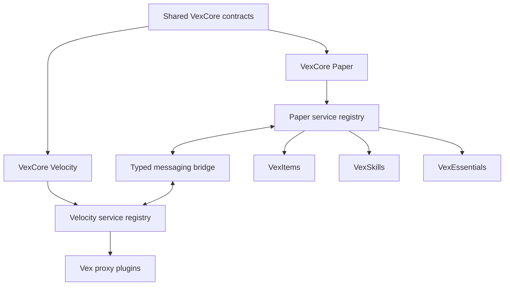

<div align="center">
  <h1>VexCore</h1>
  <p><strong>The shared infrastructure behind the VexSoft plugin ecosystem</strong></p>
  <p>
    
    
    
    
    
    <a href="https://github.com/lightPlugins/VexCore/actions/workflows/build.yml"></a>
    <a href="https://www.codefactor.io/repository/github/lightplugins/vexcore"></a>
  </p>
</div>

VexCore brings together the technical foundations that would otherwise have to be built and maintained separately in every project. It gives VexSoft plugins a consistent environment and allows them to work together without tightly coupling their implementations.

> [!IMPORTANT]
> VexCore is infrastructure, not a gameplay plugin. Items, skills, quests, and general server features remain in their own projects.

## At a Glance

| Foundation | Player-facing systems | Runtime | Compatibility |
| --- | --- | --- | --- |
| Scoped service registries | Localization and placeholders | Paper, Folia, and Velocity | Minecraft version adapters |
| Server and proxy plugin lifecycles | Commands and inventories | Player data, stats, and caching | Packet abstraction |
| Configuration and messaging | Reactor triggers and effects | PostgreSQL persistence | Data Component abstraction |

## Purpose

Every VexSoft plugin receives its own isolated service scope. Paper plugins and Velocity plugins use their own platform registry, while shared contracts keep their structure consistent without exposing concrete implementations.

VexCore also manages the shared plugin lifecycle. Services, commands, listeners, inventories, message handlers, and data containers follow the same registration rules and are released in a controlled way when a plugin shuts down. A typed messaging layer connects backend servers through the Velocity proxy when communication has to cross process boundaries.

The goal is simple: provide a modern and predictable foundation for new plugins without rebuilding the same infrastructure every time.



> [!NOTE]
> Each plugin owns an isolated service scope. Shared contracts remain accessible through VexCore while plugin-specific implementations stay separate.

## Features

### Service Registry

- Owner- and plugin-scoped services
- Hierarchical resolution between plugins and internal modules
- Lazy references for services that become available later
- Class-based creation of service implementations
- Dependency validation and ordered initialization
- Safe rollback when a service cannot be created
- Controlled cleanup of every service owned by a plugin

### Shared Plugin Foundation

- Consistent lifecycles through `VexPlugin` and `VexProxyPlugin`
- Central registration of services, commands, listeners, and inventories
- An isolated service registry for each plugin
- Configurable and colored console prefixes
- Automatic connection to the local Paper or Velocity infrastructure
- Clear separation between public APIs and runtime implementations

### Cross-Server Messaging

- Typed messages shared by Paper and Velocity plugins
- Versioned and validated message envelopes
- JSON payloads without Java serialization
- Targets for the proxy, individual servers, players, or the complete network
- Owner and source-server metadata for received messages
- Class-based message handler registration through scoped services
- Short-lived pending delivery for temporarily empty backend servers
- A built-in proxy ping diagnostic with localized results

> [!NOTE]
> Paper and Velocity run in separate processes and therefore keep separate service registries. Messaging connects those registries without pretending that Java service instances can be shared across process boundaries.

### Configuration System

- YAML configurations powered by Configurate
- A shared directory structure under `plugins/VexSoft/PluginName`
- Bundled default files and user-defined configurations
- Structured sections and typed values
- Readable warnings for invalid or broken files

### Localization System

- Adventure Components instead of plain text messages
- Any number of language files per plugin and language
- English defaults with automatic fallback behavior
- Support for both single messages and multi-line lists
- Placeholders, prefixes, and direct message delivery
- One centrally stored player language shared by all VexSoft plugins
- Language files can be reloaded while the server is running

### Placeholder System

- Every placeholder is resolved from a loaded `VexPlayer`
- Class-based registration with automatic plugin namespaces
- Dynamic argument paths such as `%vexskills_skill_mining_level%`
- Request-local placeholders such as `%level%` for one expression or render operation
- Cached templates avoid reparsing frequently rendered text
- PlaceholderAPI support in both directions when it is installed

### Stats and Reactor

- Dynamically registered, namespaced stats with stable persistence keys
- Array-backed values for loaded players and retained database values while a stat is unloaded
- Permanent values and temporary flat or multiplicative modifiers
- Stat names and descriptions resolved from the owning plugin's language files
- Class-registered triggers, filters, conditions, and effects with globally unique IDs
- Trigger-specific filters and global conditions in configuration
- Atomic compiled reaction snapshots and owner-scoped reloads
- Namespaced Minecraft resource keys such as `minecraft:stone`, ready for custom providers

### Command Framework

- Class-based command registration without command entries in `plugin.yml`
- Root commands, subcommands, and arguments
- Optional and greedy arguments
- Dynamic suggestions
- Permission checks for both execution and suggestions
- One command structure shared across all plugins

### Player Data

- One global `VexPlayer` for each player
- Extensible data containers owned by individual plugins
- Shared access to cached player data
- Controlled and thread-safe container updates
- PostgreSQL persistence with automatic schema extension
- Saving on disconnect, shutdown, and scheduled autosaves
- New data containers can be introduced through later plugin updates

### Cache System

- Synchronous and asynchronous caching powered by Caffeine
- Configurable size and expiration limits
- Cache statistics and centralized management
- Reusable caches for frequently requested data
- Player profiles and other commonly read values remain available in memory

### Scheduler

- One scheduling API for Paper and Folia
- Synchronous and asynchronous tasks
- Immediate, delayed, and repeating execution
- Safe handling of global, regional, and entity-bound work
- Automatic task cleanup when the owning plugin is disabled

### Inventory Framework

- Class-based inventory registration
- Reusable foundations for inventories, buttons, and pagination
- Previous and next page navigation
- Navigation history and direct returns to a specific menu
- Fully replaceable default buttons
- Managed inventory sessions

### Dialog System

- A central abstraction for Paper's experimental Dialog API
- Class-based dialog definitions
- Managed active dialog sessions
- Typed results and controlled cancellation
- Automatic cleanup when players leave or an owning plugin shuts down

> [!CAUTION]
> Paper's Dialog API is experimental. VexCore keeps dialog-specific behavior behind a dedicated abstraction so changes remain contained.

### Packet System

- Version-specific packet adapters
- Compatible adapters can be reused across multiple Minecraft versions
- Individual behavior can be replaced when only a small part breaks
- Text displays, item displays, passengers, and interactive holograms
- Packet effects for hits, glowing entities, and lightning
- Packet-based item names and lore
- Initial support starts with Minecraft 26.2

### Item Foundation

- An ItemStack builder based on Paper's Data Component API
- Stable VexCore component keys in front of version-specific components
- Support for item models and tooltip styles
- Version adapters for Data Components that may change between Minecraft releases
- Packet-based presentation without unnecessarily changing persistent item data

> [!NOTE]
> Packets and Data Components are version-sensitive by nature. Their implementations live behind version adapters instead of leaking Minecraft internals into other plugins.

## Architecture

VexCore is deliberately split into small modules. Public contracts are kept separate from their implementations, allowing other plugins to compile against the APIs without pulling in the runtime.

| Module | Responsibility |
| --- | --- |
| `vexcore-api` | Platform-neutral contracts for services, player data, localization, placeholders, stats, Reactor, caching, configuration, and messaging |
| `vexcore-common` | Platform-neutral implementations shared by the server and proxy runtimes |
| `vexcore-paper-api` | Public Paper and Folia contracts together with the `VexPlugin` foundation |
| `vexcore-services` | Paper-only implementations for commands, inventories, dialogs, scheduling, gameplay events, and other stable services |
| `vexcore-items:common` | Public item and Data Component contracts |
| `vexcore-items:versions:v26_2` | Minecraft 26.2 Data Component implementation |
| `vexcore-packets:common` | Public packet contracts |
| `vexcore-packets:versions:v26_2` | Minecraft 26.2 packet implementation |
| `vexcore-paper` | The server plugin that connects and starts every module |
| `vexcore-velocity-api` | Public Velocity contracts together with the `VexProxyPlugin` foundation |
| `vexcore-velocity` | The proxy plugin that owns Velocity services and routes network messages |

## Creating a Paper Plugin

Compile a Paper plugin against the Paper API module. VexCore itself remains a required runtime
dependency and supplies the implementations.

```kotlin
dependencies {
    compileOnly("dev.vexsoft:vexcore-paper-api:1.0.0-SNAPSHOT")
}
```

```yaml
name: VexSkills
main: dev.vexsoft.skills.VexSkillsPlugin
version: 1.0.0
api-version: "1.21"
depend:
  - VexCore
```

Extend `VexPlugin` and use its scoped services from the appropriate lifecycle hook:

```java
public final class VexSkillsPlugin extends VexPlugin {

  @Override
  protected void registerServices() {
    getServices().register(SkillService.class, VexSkillService.class);
  }

  @Override
  protected void onVexLoad() {
    PlaceholderService placeholders = getServices().require(PlaceholderService.class);
    placeholders.register(SkillPlaceholder.class);
  }
}
```

Each placeholder class owns one local ID. VexCore adds the plugin namespace automatically:

```java
@PlaceholderId("skill")
@Dependencies(SkillService.class)
public final class SkillPlaceholder implements VexPlaceholder {

  private final SkillService skills;

  public SkillPlaceholder(VexServiceRegistry services) {
    skills = services.require(SkillService.class);
  }

  @Override
  public String resolve(VexPlayer player, PlaceholderArguments arguments) {
    return skills.resolve(player, arguments.asList());
  }
}
```

This class resolves placeholders such as `%vexskills_skill_mining_level%`. Local values that only
exist for one render can be supplied with `PlaceholderContext.of(player).with("level", level)` and
are not exposed to PlaceholderAPI.

### Registering and Localizing Stats

Stat keys use the normalized plugin name as their namespace. By default, the following definition
loads its presentation from `stats.strength.name` and `stats.strength.description` in the owning
plugin's language files:

```java
StatDefinition strength = StatDefinition.builder(StatKey.of("vexskills", "strength"))
    .defaultValue(0)
    .minimum(0)
    .build();

StatRegistry stats = getServices().require(StatRegistry.class);
stats.synchronize(List.of(strength));
```

```yaml
# languages/en_EN.yml
stats:
  strength:
    name: "<red>Strength"
    description:
      - "<gray>Increases your physical damage."
      - "<gray>Current value: <white>%vexskills_stat_strength_value%"
```

Use `StatLocalizationService#getName` and `getDescription` with a `VexPlayer`; resolution always
uses the stat owner's language files, even when a different plugin displays the stat.

### Loading Reactions from Configuration

`ReactionConfigurationService` accepts any list path. The section name is owned by the consuming
plugin and is not prescribed by VexCore. Each trigger has its own filters, while conditions apply
to every trigger in that reaction:

```yaml
xp-gain-methods:
  - reaction-id: mining-stone
    enabled: true
    triggers:
      - id: break-block
        filters:
          blocks:
            - minecraft:stone
            - minecraft:deepslate
    conditions:
      - id: permission
        args:
          permission: vexskills.xp.mining
    effects:
      - id: vexskills-give-xp
        args:
          skill: mining
          amount: "10 + (%vexskills_skill_mining_level% * 0.25)"
```

Plugins register their own trigger, filter, condition, and effect classes through their scoped
registries. Reactor IDs are global: a duplicate registration is ignored with a clear console
warning naming both plugins.

For a reload, first build the complete desired stat definition collection and then call the
three-argument `ReactionConfigurationService#reload`. VexCore synchronizes the plugin's stats,
compiles the complete reaction set, and restores the previous stats if compilation fails. No other
plugin and no VexCore-wide reload is affected.

## Platforms

VexCore is built for modern Paper servers, supports Folia from the start, and provides a dedicated Velocity plugin for proxy-side infrastructure. Platform-specific behavior is hidden behind shared services, while `VexPlugin` and `VexProxyPlugin` provide the appropriate lifecycle for each environment.

Paper and Velocity keep independent service registries because they run in different processes. The messaging system provides the controlled bridge between them and can route typed messages across backend servers through Velocity.

Version-sensitive areas such as packets and Data Components live in dedicated submodules. This allows new Minecraft versions to be added without copying implementations that are still compatible.

> [!TIP]
> Compatible adapters can be reused by later Minecraft versions. A new implementation is only needed for the behavior that actually changed.

## Scope

VexCore only contains systems that are useful to multiple plugins. Concrete content remains in the projects built on top of it, for example:

- VexItems provides configurable items, categories, and item registration
- VexSkills provides skills, experience, and progression
- VexEssentials provides general server features

These plugins can register their own services and data containers, then communicate through VexCore. VexCore remains the technical foundation and does not take ownership of domain-specific gameplay logic.
