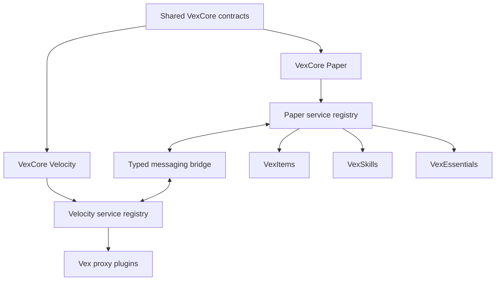

<div align="center">
  <h1>VexCore</h1>
  <p><strong>The shared infrastructure behind the VexSoft plugin ecosystem</strong></p>
  <p>
    
    
    
    
    
    <a href="https://github.com/lightPlugins/VexCore/actions/workflows/build.yml"></a>
    <a href="https://www.codefactor.io/repository/github/lightplugins/vexcore"></a>
  </p>
</div>

VexCore brings together the technical foundations that would otherwise have to be built and maintained separately in every project. It gives VexSoft plugins a consistent environment and allows them to work together without tightly coupling their implementations.

> [!IMPORTANT]
> VexCore is infrastructure, not a gameplay plugin. Items, skills, quests, and general server features remain in their own projects.

## At a Glance

| Foundation | Player-facing systems | Runtime | Compatibility |
| --- | --- | --- | --- |
| Scoped service registries | Localization and placeholders | Paper, Folia, and Velocity | Minecraft version adapters |
| Server and proxy plugin lifecycles | Commands and inventories | Player data, stats, and caching | Packet abstraction |
| Configuration and messaging | Rewards, costs, and requirements | PostgreSQL persistence | Data Component abstraction |

## Purpose

Every VexSoft plugin receives its own isolated service scope. Paper plugins and Velocity plugins use their own platform registry, while shared contracts keep their structure consistent without exposing concrete implementations.

VexCore also manages the shared plugin lifecycle. Services, commands, listeners, inventories, message handlers, and data containers follow the same registration rules and are released in a controlled way when a plugin shuts down. A typed messaging layer connects backend servers through the Velocity proxy when communication has to cross process boundaries.

The goal is simple: provide a modern and predictable foundation for VexSoft plugins without rebuilding the same infrastructure in every project.



> [!NOTE]
> Each plugin owns an isolated service scope. Shared contracts remain accessible through VexCore while plugin-specific implementations stay separate.

## Features

### Service Registry

- Owner- and plugin-scoped services
- Hierarchical resolution between plugins and internal modules
- Lazy references for services that become available later
- Class-based creation of service implementations
- Dependency validation and ordered initialization
- Safe rollback when a service cannot be created
- Controlled cleanup of every service owned by a plugin

### Shared Plugin Foundation

- Consistent lifecycles through `VexPlugin` and `VexProxyPlugin`
- Central registration of services, commands, listeners, and inventories
- An isolated service registry for each plugin
- Configurable and colored console prefixes
- Automatic connection to the local Paper or Velocity infrastructure
- Clear separation between public APIs and runtime implementations

### Cross-Server Messaging

- Typed messages shared by Paper and Velocity plugins
- Versioned and validated message envelopes
- JSON payloads without Java serialization
- Targets for the proxy, individual servers, players, or the complete network
- Owner and source-server metadata for received messages
- Class-based message handler registration through scoped services
- Short-lived pending delivery for temporarily empty backend servers
- A built-in proxy ping diagnostic with localized results
- Velocity-backed online-player directory lookups
- Cross-server player transfers with destination-server arrival handoff

> [!NOTE]
> Paper and Velocity run in separate processes and therefore keep separate service registries. Messaging connects those registries without pretending that Java service instances can be shared across process boundaries.

### Configuration System

- YAML configurations powered by Configurate
- A shared directory structure under `plugins/VexSoft/PluginName`
- Bundled default files and user-defined configurations
- Structured sections and typed values
- Readable warnings for invalid or broken files

### Localization System

- Adventure Components instead of plain text messages
- Any number of language files per plugin and language
- English defaults with automatic fallback behavior
- Support for both single messages and multi-line lists
- Placeholders, prefixes, and direct message delivery
- One centrally stored player language shared by all VexSoft plugins
- Language files can be reloaded while the server is running

### Placeholder System

- Every placeholder is resolved from a loaded `VexPlayer`
- Class-based registration with automatic plugin namespaces
- Dynamic argument paths such as `%vexskills_skill_mining_level%`
- Request-local placeholders such as `%level%` for one expression or render operation
- Cached templates avoid reparsing frequently rendered text
- PlaceholderAPI support in both directions when it is installed

### Stats and Progression Primitives

- Dynamically registered, namespaced stats with stable persistence keys
- Array-backed values for loaded players and retained database values while a stat is unloaded
- Permanent values and temporary flat or multiplicative modifiers
- Stat names and descriptions resolved from the owning plugin's language files
- Owner-scoped providers for reconstructable runtime stat contributions
- Automatic contribution rebuilds after player data loads and explicit refreshes after plugin reloads
- Complete contribution snapshots replace old values without persisting derived final stats
- Extensible `rewards`, `costs`, and `requirements` sections compiled once during configuration reload
- Built-in Stats support, Vault-backed Coins support, and online Permission requirements
- Shared expression variables such as `%level%` without coupling VexCore to a skill system

### Rewards, Costs, and Requirements

Progression remains owned by external plugins. VexCore does not know what a skill level or
collection level is; it compiles and executes the three sections supplied by those plugins.
Installed plugins can register additional direct keys independently in each domain.

```yaml
rewards:
  coins: "200 * %level%"
  stats:
    mining_chunk_damage: "1"
    defense: "(2 * %level%) / 5"

costs:
  coins: "50 * %level%"

requirements:
  coins: "1000"
  stats:
    mining_power: "2 * %level%"
  permission:
    - "vexskills.mining"
    - "vexskills.mining.advanced"
```

- Reward keys are registered through `RewardRegistry`
- Cost keys are registered through `CostRegistry`
- Requirement keys are registered through `RequirementRegistry`
- Unknown keys fail configuration compilation instead of being silently skipped
- Costs are checked before consumption and successful earlier entries are compensated if a later
  entry fails
- Requirement entries use AND semantics and never mutate player state
- Reward and requirement implementations provide Adventure Components for consistent chat, lore,
  and menu presentation

`coins` is registered only when Vault and an economy provider are available. `stats` rewards are
reconstructable contributions rather than permanent database mutations. Items are intentionally not
part of this first implementation and will be designed separately.

External systems with derived stats register a contribution provider:

```java
services.require(StatContributionRegistry.class)
    .register("skills", SkillStatContributionProvider.class);
```

The provider returns its complete current snapshot for a player:

```java
@Override
public Map<StatKey, StatModifier> calculate(final VexPlayer player) {
  return Map.of(
      StatKey.of("vexskills", "mining_chunk_damage"), StatModifier.flat(9D),
      StatKey.of("vexskills", "mining_block_break_speed"), StatModifier.flat(40D)
  );
}
```

VexCore applies every provider after `PlayerDataLoadedSignal`, replaces the provider's previous
snapshot in one stat update batch, and removes its runtime modifiers when the player leaves or the
provider is unregistered. A plugin calls `refresh(player, "skills")` after relevant data changes and
`refreshAll("skills")` after reloading its progression configuration. Only permanent stat values are
stored in VexCore; skill, collection, equipment, and event contributions remain reconstructable from
their owning systems.

### Command Framework

- Class-based command registration without command entries in `plugin.yml`
- Root commands, subcommands, and arguments
- Optional and greedy arguments
- Dynamic suggestions
- Extensible typed argument parsers, including server IDs and namespaced world IDs
- Non-blocking command handlers through `CompletionStage` return values
- Permission checks for both execution and suggestions
- One command structure shared across all plugins

### Player Data

- One global `VexPlayer` for each player
- Extensible data containers owned by individual plugins
- Shared access to cached player data
- Controlled and thread-safe container updates
- PostgreSQL persistence with automatic schema extension
- Saving on disconnect, shutdown, and scheduled autosaves
- New data containers can be introduced through later plugin updates
- A central UUID and last-known-name index independent of individual plugin containers

### Global Data

- Plugin-owned typed values for shared data such as warps and server settings
- One storage pool shared with player persistence within each VexCore process
- Bounded Caffeine caching with PostgreSQL invalidation notifications
- Revision-based atomic updates that do not lose concurrent changes from another server
- Runtime unregistration without deleting stored values
- Restoring existing values when the same owner and key are registered again

### Worlds and Teleports

- Persistent namespaced world IDs such as `minecraft:overworld`
- No dependence on legacy Bukkit world names or filesystem folder paths
- Local teleports through Paper's `Player#teleportAsync` API
- The teleport result completes only after Paper's asynchronous chunk load and callback
- Velocity transfers retain the exact target world ID, coordinates, yaw, and pitch
- Clear results for unavailable servers, unloaded worlds, offline players, and timeouts

### Cache System

- Synchronous and asynchronous caching powered by Caffeine
- Configurable size and expiration limits
- Cache statistics and centralized management
- Reusable caches for frequently requested data
- Player profiles and other commonly read values remain available in memory

### Scheduler

- One scheduling API for Paper and Folia
- Synchronous and asynchronous tasks
- Immediate, delayed, and repeating execution
- Safe handling of global, regional, and entity-bound work
- Automatic task cleanup when the owning plugin is disabled

### Inventory Framework

- Class-based inventory registration
- Reusable foundations for inventories, buttons, and pagination
- Previous and next page navigation
- Navigation history and direct returns to a specific menu
- Fully replaceable default buttons
- Managed inventory sessions

### Dialog System

- A central abstraction for Paper's experimental Dialog API
- Class-based dialog definitions
- Managed active dialog sessions
- Typed results and controlled cancellation
- Automatic cleanup when players leave or an owning plugin shuts down

> [!CAUTION]
> Paper's Dialog API is experimental. VexCore keeps dialog-specific behavior behind a dedicated abstraction so changes remain contained.

### Packet System

- Version-specific packet adapters
- Compatible adapters can be reused across multiple Minecraft versions
- Individual behavior can be replaced when only a small part breaks
- Text displays, item displays, passengers, and interactive holograms
- Packet effects for hits, glowing entities, and lightning
- Packet-based item names and lore
- Initial support starts with Minecraft 26.2

### Item Foundation

- An ItemStack builder based on Paper's Data Component API
- Stable VexCore component keys in front of version-specific components
- Support for item models and tooltip styles
- Version adapters for Data Components that may change between Minecraft releases
- Packet-based presentation without unnecessarily changing persistent item data

> [!NOTE]
> Packets and Data Components are version-sensitive by nature. Their implementations live behind version adapters instead of leaking Minecraft internals into other plugins.

## Architecture

VexCore is deliberately split into small modules. API contracts are kept separate from their
implementations so VexSoft projects only depend on the platform contracts they actually use.

| Module | Responsibility |
| --- | --- |
| `vexcore-api` | Platform-neutral contracts for services, player and global data, identities, world positions, localization, placeholders, stats, expressions, rewards, costs, requirements, caching, configuration, and messaging |
| `vexcore-common` | Platform-neutral implementations shared by the server and proxy runtimes |
| `vexcore-paper-api` | Public Paper and Folia contracts together with the `VexPlugin` foundation |
| `vexcore-services` | Paper-only implementations for commands, inventories, dialogs, scheduling, gameplay events, and other stable services |
| `vexcore-items:common` | Public item and Data Component contracts |
| `vexcore-items:versions:v26_2` | Minecraft 26.2 Data Component implementation |
| `vexcore-packets:common` | Public packet contracts |
| `vexcore-packets:versions:v26_2` | Minecraft 26.2 packet implementation |
| `vexcore-paper` | The server plugin that connects and starts every module |
| `vexcore-velocity-api` | Public Velocity contracts together with the `VexProxyPlugin` foundation |
| `vexcore-velocity` | The proxy plugin that owns Velocity services and routes network messages |

## For Server Owners

VexCore is installed as a dependency of VexSoft plugins. It does not add gameplay content by
itself, and server owners normally do not configure its internal services individually.

### Installation

1. Install the VexCore Paper jar on every backend server that runs a VexSoft plugin.
2. Start the server once so VexCore can create its files below `plugins/VexSoft/VexCore`.
3. Configure shared storage in `database.yml` before opening the server to players.
4. Install the VexCore Velocity jar on the proxy when cross-server VexSoft features are required.
5. Set `server-id` in every Paper server's `network.yml` to its exact Velocity server name.
6. Configure the Velocity VexCore instance to use the same PostgreSQL database.
7. Restart the affected server or proxy after replacing a VexCore jar.

Paper and Velocity use separate jars because they run in different processes. The Velocity plugin
is only required for proxy-side services and network messaging; a standalone Paper server does not
need it.

### Shared Storage

PostgreSQL is the default and recommended storage for persistent player data:

```yaml
storage: postgresql

postgresql:
  jdbc-url: jdbc:postgresql://localhost:5432/vexcore
  username: postgres
  password: change-me
  maximum-pool-size: 10
  auto-create-database: true
  maintenance-database: postgres
```

With `auto-create-database: true`, VexCore attempts to create the configured database through the
maintenance database when necessary. The configured PostgreSQL account must have the corresponding
permission.

The same backend stores player containers, the central player identity index, and plugin-owned
global values. Paper and Velocity each maintain one local connection pool and must point to the same
database when global values are shared between them.

`storage: memory` is available for temporary development environments. All values are lost on
shutdown, instances cannot share changes, and it should not be used for a production network.

### Network Identity and Worlds

Each Paper backend has a `network.yml` file:

```yaml
server-id: lobby-1
```

The value must match the corresponding server name configured in Velocity. Cross-server positions
store worlds as namespaced IDs, for example `minecraft:overworld`, `minecraft:the_nether`, or a
custom ID such as `vexessentials:dungeon`. VexCore does not use legacy world names or paths below
Paper's `world/dimensions` directory to identify a world.

### Optional Integrations

PlaceholderAPI is optional. When it is installed, VexCore exposes the player-bound placeholders of
VexSoft plugins to PlaceholderAPI and can resolve placeholders provided by other expansions. Without
PlaceholderAPI, the internal placeholder system continues to work and no expansion registration is
attempted.

### Administration Commands

| Command | Permission | Purpose |
| --- | --- | --- |
| `/vexcore reload` | `vexcore.command.reload` | Reloads VexCore themes and language resources |
| `/vexcore language set <language>` | `vexcore.command.language` | Changes the executing player's language |
| `/vexcore debug performance toggle` | `vexcore.command.debug.performance` | Toggles the live performance display |
| `/vexcore debug proxy ping` | `vexcore.command.debug.proxy.ping` | Tests the connection to the Velocity plugin |

VexCore also provides explicit player-data reset commands. Every destructive command ends with the
literal `confirm` argument to reduce accidental execution:

| Command | Permission |
| --- | --- |
| `/vexcore reset player <player> container <container> confirm` | `vexcore.command.reset.player.container` |
| `/vexcore reset player <player> all confirm` | `vexcore.command.reset.player.all` |
| `/vexcore reset global container <container> confirm` | `vexcore.command.reset.global.container` |
| `/vexcore reset global all confirm` | `vexcore.command.reset.global.all` |

> [!CAUTION]
> Reset commands replace stored values with their defaults. Global resets can affect every stored
> player and should only be executed after confirming the intended scope and available backups.

### What Happens at Runtime

- Online players are represented by one shared `VexPlayer` and loaded only when their session begins.
- Player data is cached while required and saved on disconnect, shutdown, and scheduled autosaves.
- Player UUIDs and last-known names are indexed centrally for plugin-independent lookups.
- Global values are cached locally and invalidated across PostgreSQL-connected VexCore instances.
- Local teleports wait for Paper's asynchronous chunk loading and teleport result.
- Velocity transfers resolve the destination world by namespaced ID only after reaching the target
  backend.
- Dynamically removed stats disappear from runtime without deleting their stored player values.
- Reward, cost, and requirement expressions are compiled during configuration reload instead of
  being reparsed during progression events.
- Plugin-specific reloads refresh only that plugin's stat contribution providers.
- Unknown or duplicate execution keys fail with the affected domain and configuration key.
- Derived stat snapshots are rebuilt after player data loads and never written as permanent values.

The technical APIs and module boundaries are documented in the architecture and feature sections
for developers who want to understand how VexCore operates. They are not intended as a general
third-party plugin development framework.

## Platforms

VexCore is built for modern Paper servers, supports Folia from the start, and provides a dedicated Velocity plugin for proxy-side infrastructure. Platform-specific behavior is hidden behind shared services, while `VexPlugin` and `VexProxyPlugin` provide the appropriate lifecycle for each environment.

Paper and Velocity keep independent service registries because they run in different processes. The messaging system provides the controlled bridge between them and can route typed messages across backend servers through Velocity.

Version-sensitive areas such as packets and Data Components live in dedicated submodules. This allows new Minecraft versions to be added without copying implementations that are still compatible.

> [!TIP]
> Compatible adapters can be reused by later Minecraft versions. A new implementation is only needed for the behavior that actually changed.

## Scope

VexCore only contains systems that are useful to multiple plugins. Concrete content remains in the projects built on top of it, for example:

- VexItems provides configurable items, categories, and item registration
- VexSkills provides skills, experience, and progression
- VexEssentials provides general server features

These plugins can register their own services and data containers, then communicate through VexCore. VexCore remains the technical foundation and does not take ownership of domain-specific gameplay logic.
